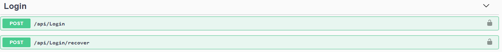
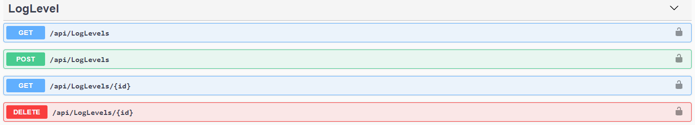
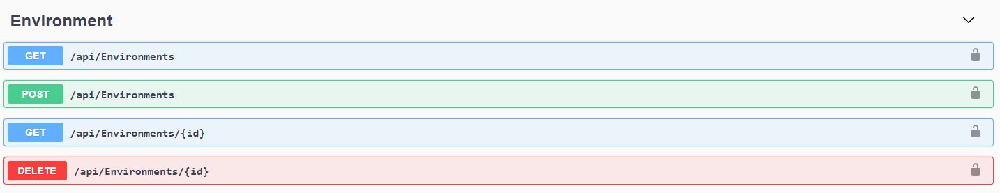
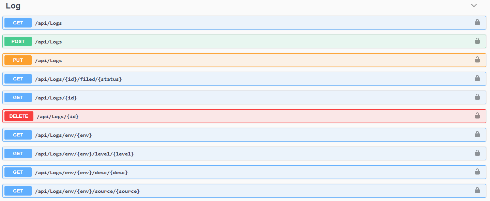
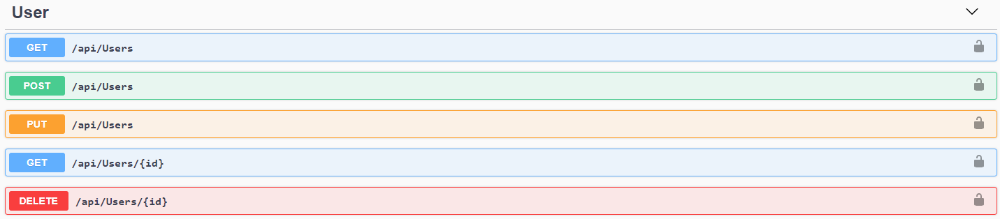

<h1 align="center">Cadê o Erro?</h1>
<h4 align="center">Projeto pratico desenvolvido na Aceleração C# do programa AceleraDev, patrocinado pela Stone</h4>

## 🤔 O que é o AceleraDev?

Criado pela Codenation, é um programa de capacitação gratuito para profissionais de tecnologia. 
Durante 10 semanas, devs e cientistas de dados têm acesso a desafios, conteúdos e à Comunidade Codenation para adquirirem e praticarem as habilidades técnicas mais utilizadas por empresas de tecnologia de todo o mundo.

## ✨ Sobre o projeto

Em projetos modernos é cada vez mais comum o uso de arquiteturas baseadas em serviços ou microsserviços. Nestes ambientes complexos, erros podem surgir em diferentes camadas da aplicação (backend, frontend, mobile, desktop) e mesmo em serviços distintos. Desta forma, é muito importante que os desenvolvedores possam centralizar todos os registros de erros em um local, de onde podem monitorar e tomar decisões mais acertadas.

E é pensando nisso que foi criado o "Cadê o Erro"!!

O "Cadê o Erro" é uma Central de Erros, responsável por gerenciar e centralizar os relatórios de erros de várias aplicações.

<a align="center" href="https://www.youtube.com/watch?v=oFzFuMDSlSI&feature=youtu.be">🎥 Apresentação</a>

## 📐 Arquitetura

A arquitetura do projeto se inspirou na orientação do modelo Clean Architecture, de Bob Martin, do qual visa separar um projeto em camadas
E com isso, o projeto possui as seguintes camadas:

#### 💰 Domain
Contem a regra de negócio (Entidades, Interfaces, etc..)

#### 💾 Data
Contem a integração com o banco de dados

#### 🏭 Server
Contem a WebAPI (Controllers, DTOs, etc..)

## 💡 Tecnologias

Esse projeto foi desenvolvido com as seguintes tecnologias:

- [DotNet Core](https://docs.microsoft.com/pt-br/dotnet/core/)
- [Entity Framework](https://www.entityframeworktutorial.net/what-is-entityframework.aspx)
- [JWT](https://jwt.io/)
- [Auto Mapper](https://automapper.org/)
- [Fluent Validation](https://fluentvalidation.net/)
- [Swagger](https://swagger.io/)
- [MSSQL](https://www.microsoft.com/pt-br/sql-server/sql-server-downloads)

## 🚗 Endpoints (Rotas)

#### Login (Sem autenticação)

#### Niveis de Log (Visualizar = Usuarios | Gerenciar = Administradores)

#### Ambientes (Visualizar = Usuarios | Gerenciar = Administradores)

#### Logs (Visualizar, Adicionar, Alterar, Arquivar = Usuarios | Deletar = Administradores)

#### Usuários (Somente Administradores)

## ❤ Agradeço muito a [Codenation](https://www.codenation.dev/) e a [Stone](https://www.stone.com.br/)
